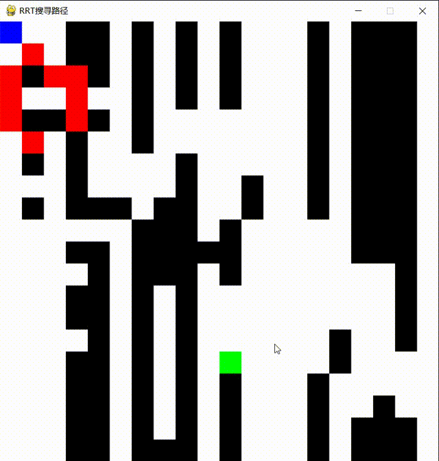
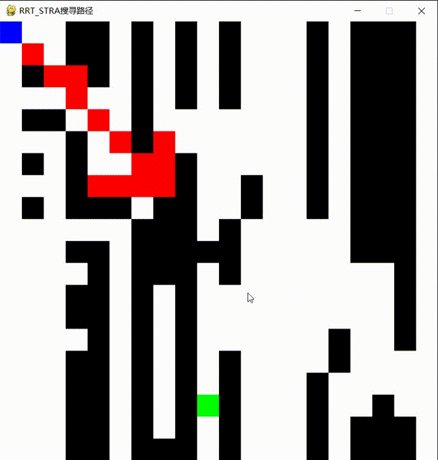
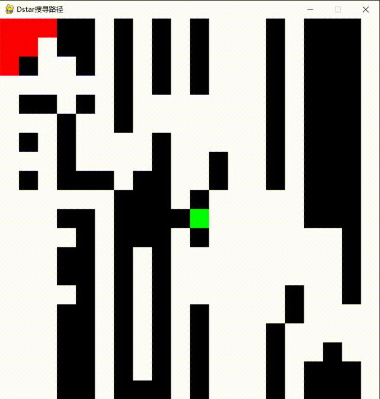
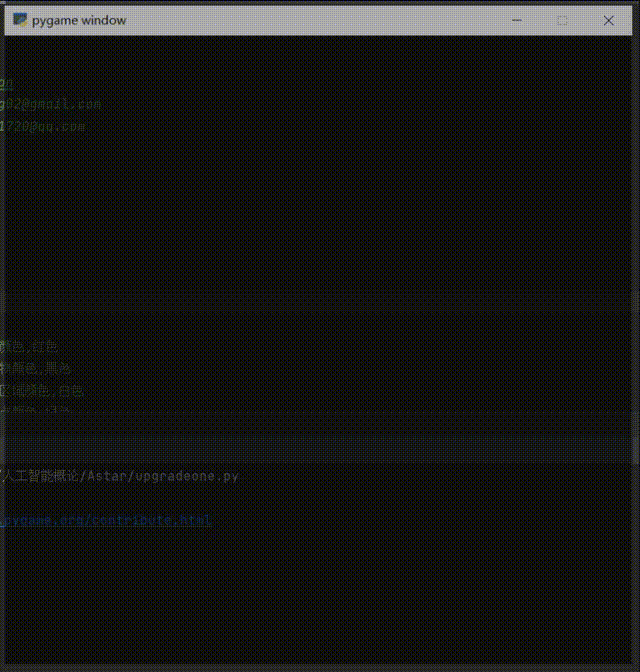
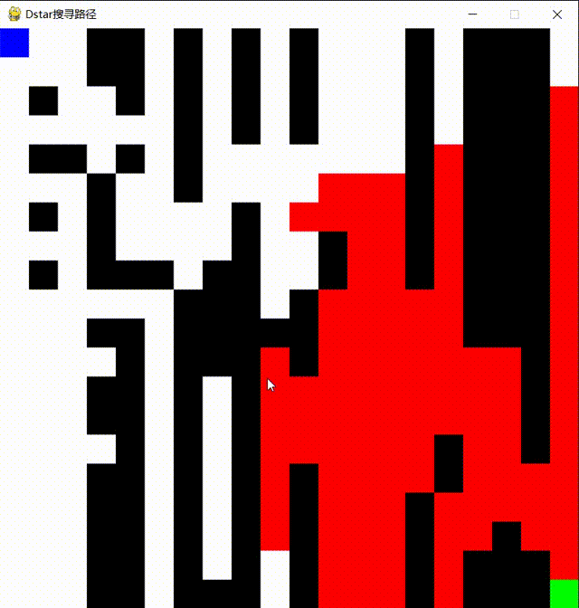

# Path_Planning_XDU_Junior3
This project is about a Path Planning System with classical algorithm and visualize using pygame.

## Algorithm including:

- RRT
<div align="center"></div>

- RRT-Star
<div align="center"></div>

- Dijkstra
<div align="center"></div>

- Astar
<div align="center"></div>

- Dstar
<div align="center"></div>


## Requirements
- numpy
- pygame

## Step by step instructions
### Create an environment or use existing one
```angular2html
conda create -n env_name python=3.7
conda activate env_name
```
### Install the requirements
```angular2html
python -m pip install --user pygame
python -m pip install --user numpy
```

### Git clone
```angular2html
git clone git@github.com:GuoPingPan/Path_Planning_XDU_Junior3.git
```

## Contract
More learning materials in our WeChat account.

如果可以的话麻烦点个Star⭐，下面是 `公众号:RanShareCo` 的信息，还有多 `笔记资料` 可私戳。

同为XDUer，希望能给大家带来帮助。

- RanShareCo

<div align="center"></div>

IF there are any other questions, please contract email:

- 731061720@qq.com
- panguoping02@gmail.com
